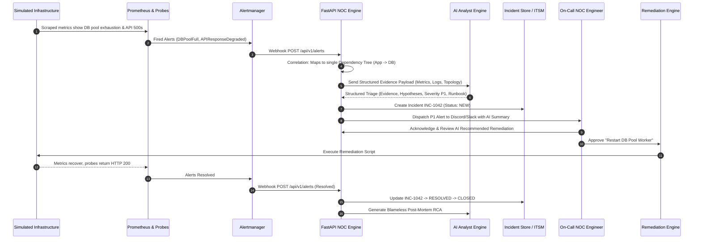

# AI-Assisted Modern Enterprise NOC Platform: Architecture & Engineering Blueprint

## 1. Executive Overview

Modern enterprise infrastructure spans hybrid clouds, physical datacenters, virtual networks, edge firewalls, containerized microservices, and legacy relational databases. In high-velocity environments, infrastructure failures manifest not as isolated events, but as **cascading storms of alerts**. A single database connection timeout can trigger hundreds of downstream API failures, synthetic probe alerts, customer-facing 500 errors, and queue backlog spikes.

Traditional Network Operations Centers (NOCs) suffer from **Alert Fatigue**, where Tier 1 analysts spend 80% of their shift acknowledging redundant notifications, manually correlating disconnected logs with metrics, and copying data between monitoring tools and ticketing systems.

The **AI-Assisted Modern Enterprise NOC Platform** is engineered to resolve this paradigm by shifting from passive dashboard monitoring to an **autonomous, proactive, and AI-augmented incident lifecycle**.

### Core Tenets
1. **Telemetry Overhaul**: Comprehensive metrics, logs, and synthetic probing across Network (L3/L4/L7), Host (OS/Resource), and Application layers.
2. **Deterministic Correlation**: Upstream topology-based and time-window correlation to collapse alert storms into a single unified incident before alerting engineers.
3. **AI with Strict Evidence Discipline**: Large Language Models serve as an analyst co-pilot, not an ungrounded oracle. AI must categorically delineate **Ground-Truth Evidence**, **Inference**, **Investigation Steps**, and **Remediation Recommendations**. Hallucination is treated as a critical defect.
4. **Policy-Gated Automation**: Remediation actions are tiered. Low-risk diagnostic commands run automatically; high-risk state-changing operations require strict human-in-the-loop authorization.

---

## 2. High-Level Architecture

```
+---------------------------------------------------------------------------------------------------------+
|                                    TARGET INFRASTRUCTURE LAYER                                         |
|  [Core Routers & Switches]    [Firewalls & Gateways]    [Linux/Win Servers]    [APIs & Databases]       |
+---------------------------------------------------------------------------------------------------------+
                                         │                    │                     │
                                         ▼ Metrics            ▼ Logs                ▼ Synthetic Probes
+─────────────────────────────────────────────────────────────────────────────────────────────────────────+
|                                      TELEMETRY & INGESTION                                              |
|  ┌───────────────────────┐   ┌────────────────────────┐   ┌──────────────────────────────────────────┐  |
|  | Prometheus Exporters  |   | Promtail Log Collector |   | Blackbox Probes (ICMP / HTTP / DNS / TCP)|  |
|  └───────────┬───────────┘   └───────────┬────────────┘   └────────────────────┬─────────────────────┘  |
+──────────────┼───────────────────────────┼─────────────────────────────────────┼────────────────────────+
               ▼                           ▼                                     ▼
+─────────────────────────────────────────────────────────────────────────────────────────────────────────+
|                                   STORAGE & QUERY ENGINE LAYER                                          |
|  ┌────────────────────────────────────────┐         ┌────────────────────────────────────────────────┐  |
|  | Prometheus TSDB (Port 9090)            |         | Grafana Loki Log Engine (Port 3100)            |  |
|  | - Metrics collection & PromQL rules    |         | - Compressed log streams & LogQL search        |  |
|  └───────────────────┬────────────────────┘         └────────────────────────┬───────────────────────┘  |
+──────────────────────┼───────────────────────────────────────────────────────┼──────────────────────────+
                       ▼ Alert Rules Fired                                     │ Log Context Queries
+──────────────────────────────────────────────────────────────────────────────┼──────────────────────────+
|                                    ROUTING & ORCHESTRATION LAYER             │                          |
|  ┌────────────────────────────────────────┐                                  │                          |
|  | Alertmanager (Port 9093)               |                                  │                          |
|  | - Grouping, Deduplication, Silencing   |                                  │                          |
|  └───────────────────┬────────────────────┘                                  │                          |
|                      ▼ Webhook Forwarding                                    │                          |
|  ┌───────────────────────────────────────────────────────────────────────────┴───────────────────────┐  |
|  | NOC Orchestration Backend (FastAPI - Port 8000)                                                   |  |
|  | - Ingestion Pipeline & Event Normalization                                                        |  |
|  | - Topology & Time-Window Alert Correlation Engine                                                 |  |
|  | - Statistical Anomaly Detection (Z-Score & Rolling Baseline)                                      |  |
|  | - Incident State Machine (NEW -> ACK -> INVESTIGATING -> MITIGATING -> RESOLVED -> CLOSED)        |  |
|  └───────────────────┬───────────────────────────────────────────────────────┬───────────────────────┘  |
+──────────────────────┼───────────────────────────────────────────────────────┼──────────────────────────+
                       ▼ Normalized Context                                    ▼ Gated Action Signals
+───────────────────────────────────────────+       +─────────────────────────────────────────────────────+
|           AI TRIAGE ENGINE                |       |        AUTOMATION & REMEDIATION (n8n / Webhooks)    |
|  - Ground-Truth Evidence Parser           |       |  - Automated Evidence Enrichment                    |
|  - Root-Cause Hypothesis Generator        |       |  - Low-Risk Remediation (Auto cache flush/restart)  |
|  - Confidence & Unknowns Scoring          |       |  - High-Risk Remediation (Requires Human Approval)   |
+──────────────────────┬────────────────────+       +──────────────────────────┬──────────────────────────+
                       ▼ Enriched Incident                                     ▲
+──────────────────────────────────────────────────────────────────────────────┴──────────────────────────+
|                                       ITSM & NOTIFICATION BUS                                           |
|  - Ticketing Engine (SQLite / PostgreSQL / External ITSM Webhook)                                        |
|  - Notification Dispatcher (Multi-Tier: Discord, Slack, MS Teams, Email)                                |
+─────────────────────────────────────────────────────────────────────────────────────────────────────────+
                                         │
                                         ▼
+─────────────────────────────────────────────────────────────────────────────────────────────────────────+
|                               UNIFIED SINGLE PANE OF GLASS: GRAFANA                                      |
|  [1. NOC Overview]  [2. Network Ops]  [3. Server Ops]  [4. App Ops]  [5. Incident Ops]  [6. AI Ops]      |
+─────────────────────────────────────────────────────────────────────────────────────────────────────────+
```

---

## 3. Technology Stack Justification

| Category | Selected Technology | Alternative Evaluated | Rationale & Justification |
| :--- | :--- | :--- | :--- |
| **Log Management** | **Grafana Loki** | OpenSearch / Elasticsearch | OpenSearch requires high JVM memory (4GB-8GB minimum heap) and complex shard management. Loki indexes only metadata/labels and compresses raw chunks, operating under ~200MB RAM. Furthermore, Loki integrates natively with Grafana and synchronizes timestamps with Prometheus metrics seamlessly. |
| **Metrics Engine** | **Prometheus** | InfluxDB / VictoriaMetrics | Prometheus is the de facto cloud-native industry standard for pull-based scraping, multi-dimensional data models, and powerful alerting rules via PromQL. |
| **Alert Routing** | **Prometheus Alertmanager** | Custom Webhook Script | Provides battle-tested alert grouping, silencing, throttling, and inhibits downstream alerts when an upstream dependency is known to be dead. |
| **Event Orchestrator**| **FastAPI (Python 3.10+)**| Node.js / Go | Python is the undisputed lingua franca for AI/LLM SDKs, statistical anomaly math (NumPy/SciPy), and infrastructure automation. FastAPI provides asynchronous high-performance REST APIs with strict Pydantic schemas. |
| **Queue / Event Bus**| **AsyncIO / In-Memory Queue (Redis Optional)**| Apache Kafka / Redpanda | Kafka introduces ZooKeeper/KRaft clustering complexity, high operational overhead, and JVM dependencies. For mid-level enterprise throughput (<10,000 events/sec), an asynchronous Python message queue or Redis PubSub gives microsecond latency with zero maintenance. |
| **Incident Store** | **SQLite (Dev) / PostgreSQL (Prod)**| MongoDB | Relational models ensure referential integrity between Alerts, Incidents, Investigation Logs, and Remediation Actions. SQLite requires zero configuration for local test environments. |
| **AI Layer** | **Configurable LLM Engine** | Static Rule Engine | Modular adapter pattern supporting Google Gemini, OpenAI, Local Ollama, or a Deterministic Mock LLM for offline testing without API costs. |

---

## 4. End-to-End Data Flow



---

## 5. Security & Safety Principles

1. **Strict LLM Ground-Truth Guardrails**: Prompts explicitly reject hypothetical assertions. If a metric or log is missing from the payload, it is placed in the `unknowns` field rather than hallucinated.
2. **Dual-Tier Remediation**:
   - *Tier A (Diagnostic)*: Read-only diagnostics (ping, traceroute, ps, netstat, curl) execute autonomously.
   - *Tier B (Remediation)*: Mutating operations (restart service, reload firewall rules, flush buffers) require digital human sign-off.
3. **Secret Isolation**: All credentials and API keys reside exclusively in `.env`, never in code or logs.
